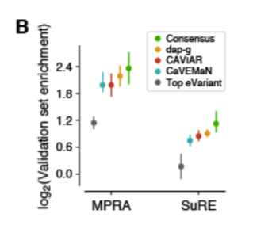

```{r setup}
rm(list = ls())
library(ggplot2)
theme_set(theme_bw(base_size = 12))
library(dplyr)
library(reshape2)
library(data.table)
options(datatable.fread.datatable = FALSE)
options(stringsAsFactors = FALSE)
source('../code/rlib_analysis.R')
datadir = '/Users/yanyul/Desktop/mixqtl-pipeline-results/postprocess-finemap'
cbPalette <- c('ascQTL' = "#999999", 'mixFine' = "#E69F00", 'trcQTL' = "#56B4E9", 'vanilla' = "#009E73", "#F0E442", "#0072B2", "#D55E00", "#CC79A7")
source('https://gist.githubusercontent.com/liangyy/43912b3ecab5d10c89f9d4b2669871c9/raw/8151c6fe70e3d4ee43d9ce340ecc0eb65172e616/my_ggplot_theme.R')
th$panel.border = element_rect(colour = th$axis.line$colour)
ifrun = FALSE
```

# Analysis plan

Here the goal is to make similar figure as 



I started with SuRE data.
The preprocessing is at `misc_data/prep_SuRE.sh`.

# Load SuRE and finemapping results

```{r load-sure}
method_df = data.frame(method = c('mixfine', 'nefine'), tag = c('mixFine', 'vanilla'))
if(ifrun == TRUE) {
sure_dir = '../misc_data'
sure_data_df = data.frame(name = c('SuRE_SNP_table_LP190708'))
sure_data_collector = list()
for(n in 1 : nrow(sure_data_df)) {
  i = sure_data_df$name[n]
  d1 = fread(paste0('zcat < ', sure_dir, '/', 'mapped-', i, '.txt.gz'), header = T)
  # colnames(d1) = stringr::str_remove(colnames(d1), sure_data_df$remove[n])
  d1 = d1[!duplicated(d1$annotated_snpid), ]
  for(m in 1 : nrow(method_df)) {
    d2 = fread(paste0('zcat < ', datadir, '/', 'Whole_Blood-x-result_pip-', method_df$method[m], '-IN-mapped-', i, '.txt.gz'), header = T, stringsAsFactors = FALSE)
    d2 = d2 %>% group_by(variant_id) %>% summarize(variable_prob = max(variable_prob, na.rm = TRUE)) %>% ungroup()
    merge = inner_join(d1, d2, by = c('annotated_snpid' = 'variant_id'))
    sure_data_collector[[length(sure_data_collector) + 1]] = merge %>% mutate(data = i, method = method_df$tag[m])
  }
  
}
df = do.call(rbind, sure_data_collector)
}
```

# Plot -log(p) againist PIP

```{r sure-plot}
if(ifrun == TRUE) {
n = 500000
snps = unique(df$annotated_snpid)
snps_selected = snps[sample(1 : length(snps), n)]
df %>% filter(annotated_snpid %in% snps_selected) %>% ggplot() + geom_point(aes(x = variable_prob, y = -log(k562.wilcox.p.value))) + facet_grid(data ~ method)
}
```

# Plot -log(p) for PIP > 0.5 vs PIP < 0.01

```{r sure-plot2}
if(ifrun == TRUE) {
df_sub = df %>% filter(annotated_snpid %in% snps_selected) %>% filter(variable_prob > 0.5 | variable_prob < 0.01)
df_sub$label = 'PIP>0.5'
df_sub$label[df_sub$variable_prob < 0.01] = 'PIP<0.01'
df_sub %>% ggplot() + geom_boxplot(aes(x = label, y = -log(k562.wilcox.p.value), color = method)) + facet_wrap(~data)
df_sub %>% group_by(label, method, data) %>% summarize(median(-log(k562.wilcox.p.value)))
}
```

# Generate input files for `torus`

Summary statistics.

```{r}
if(ifrun == TRUE) {
p2z_with_sign = function(ref, alt, p) {
  qnorm(p / 2) * sign(ref - alt)
}
signed_z_h = p2z_with_sign(df$hepg2.ref.mean, df$hepg2.alt.mean, df$hepg2.wilcox.p.value)
signed_z_k = p2z_with_sign(df$k562.ref.mean, df$k562.alt.mean, df$k562.wilcox.p.value)
sum_stat = df %>% select(liftover_chr, liftover_pos, method, data, annotated_snpid, variable_prob) %>% mutate(hepg2.z = signed_z_h, k562.z = signed_z_k, hepg2.p = df$hepg2.wilcox.p.value, k562.p = df$k562.wilcox.p.value) 
}
```

Load LD blocks.

```{r}
if(ifrun == TRUE) {
library(SilverStandardPerformance)
data("ld_block_pickrell_eur_b38")
m = 1  # the two methods share the same set of SNPs
df_this = sum_stat %>% filter(method == method_df$tag[m])
tmp_ = df_this %>% select(liftover_chr, liftover_pos, annotated_snpid) %>% rename(chromosome = liftover_chr, position = liftover_pos)
o = SilverStandardPerformance:::gwas_hit_to_gwas_loci_by_ld_block(tmp_, ld_block_pickrell_eur_b38)
o = o[!duplicated(o$annotated_snpid), ]
df_this = left_join(df_this, o %>% select(annotated_snpid, region_name), by = 'annotated_snpid')
df_this$region_name[is.na(df_this$region_name)] = 'NA'
}
```

Output summary statistics.

```{r}
if(ifrun == TRUE) {
for(n in c('hepg2', 'k562')) {
  out = data.frame(SNP = df_this$annotated_snpid, region = df_this$region_name, zscore = df_this[[paste0(n, '.z')]])
  gz1 = gzfile(paste0('../output/torus_input.', n, '.sum_stat.gz'), "w")
  write.table(out, gz1, quote = F, col.names = T, row.names = F, sep = '\t')
  close(gz1)
}
}
```

Annotations.

```{r}
cutoffs = c(0.5, 0.8)
if(ifrun == TRUE) {
for(m in 1 : nrow(method_df)) {
  tmp = sum_stat %>% filter(method == method_df$tag[m])
  for(cc in cutoffs) {
    annot = data.frame(SNP = tmp$annotated_snpid, pip_d = (tmp$variable_prob > cc) * 1)
    gz1 = gzfile(paste0('../output/torus_input.', method_df$method[m], '.pip_cutoff_', cc, '.annot.gz'), "w")
    write.table(annot, gz1, quote = F, col.names = T, row.names = F, sep = '\t')
    close(gz1)
  }
}
}
```

# Run torus

```{r}
if(ifrun == TRUE) {
run_torus = function(gwas, annot, output) {
  cmd = paste('/Users/yanyul/Documents/repo/github/torus/dev/torus', '-est', '-d', gwas, '-annot', annot, '--load_zval', '>', output)
  message('Running: ', cmd)
  system(cmd)
}
for(g in c('hepg2', 'k562')) {
  gwas = paste0('../output/torus_input.', g, '.sum_stat.gz')
  for(m in 1 : nrow(method_df)) {
    method = method_df$method[m]
    for(cc in cutoffs) {
      annot = paste0('../output/torus_input.', method, '.pip_cutoff_', cc, '.annot.gz')
      output = paste0('../output/torus_output.', method, '.pip_cutoff_', cc, '_x_', g, '.log')
      if(!file.exists(output)) {
        run_torus(gwas, annot, output)
      }
    }
  }
}
}
```

# See results

```{r}
parser = function(logfile) {
  f = read.table(logfile, header = F, stringsAsFactors = FALSE)
  colnames(f) = c('variable', 'logodds_ratio', 'ci95_low', 'ci95_high')
  f
}
result = list()
for(g in c('hepg2', 'k562')) {
  gwas = paste0('../output/torus_input.', g, '.sum_stat.gz')
  for(m in 1 : nrow(method_df)) {
    method = method_df$method[m]
    for(cc in cutoffs) {
      output = paste0('../output/torus_output.', method, '.pip_cutoff_', cc, '_x_', g, '.log')
      result[[length(result) + 1]] = parser(output) %>% mutate(method = method, celltype = g, pip_cutoff = cc)
    }
  }
}
result = do.call(rbind, result)
```

```{r}
result %>% filter(variable == 'pip.1') %>% 
  ggplot() + 
  geom_point(aes(x = factor(pip_cutoff), y = logodds_ratio, group = method, color = method), position = position_dodge(width = 0.3)) + 
  geom_errorbar(aes(x = factor(pip_cutoff), ymax = ci95_high, ymin = ci95_low, group = method, color = method), position = position_dodge(width = 0.3), width = 0.1) + 
  facet_wrap(~celltype) +
  th
```